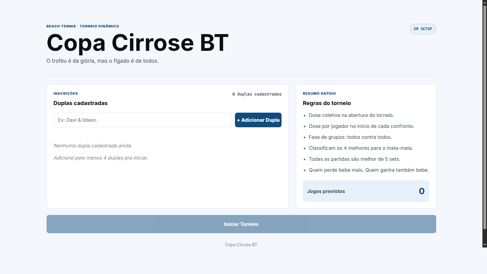

# Copa Cirrose BT



Aplicação web para gerenciar um torneio dinâmico de Beach Tennis. O usuário cadastra as duplas, inicia o torneio e o sistema gera automaticamente a fase de grupos em todos contra todos, calcula a classificação e monta o mata-mata com semifinal e final.

O projeto foi pensado para uso temporário em uma VPS, sem autenticação, em rede confiável.

## Stack

- Python 3.11+
- Django 5.x
- SQLite
- Templates Django
- HTML, CSS e JavaScript vanilla
- Gunicorn
- Nginx
- WhiteNoise
- python-decouple

## Como Rodar Local

```bash
python3 -m venv venv
source venv/bin/activate
pip install -r requirements.txt
cp .env.example .env  # ajustar variaveis
python manage.py migrate
python manage.py runserver
```

Depois acesse:

```text
http://127.0.0.1:8000/
```

Variaveis principais do `.env`:

```env
SECRET_KEY=sua-chave-secreta
DEBUG=True
ALLOWED_HOSTS=localhost,127.0.0.1
URL_PATH_PREFIX=
```

## Fluxo de Uso

1. Acessar `/`.
2. Cadastrar duplas, com minimo de 4.
3. Clicar em "Iniciar Torneio".
4. Preencher os placares conforme os jogos acontecem.
5. Acompanhar classificação e mata-mata em tempo real.
6. Exportar o relatorio final para colar no WhatsApp.

## Regras Principais

- Fase de grupos em todos contra todos.
- Partidas em melhor de 5 sets, com vencedor chegando a 3 sets.
- Vitoria vale 3 pontos.
- Desempate por vitorias, confronto direto quando houver duas duplas empatadas, saldo de sets e sets feitos.
- Os 4 primeiros classificam para o mata-mata.
- SF1: 1o x 4o.
- SF2: 2o x 3o.
- Final: vencedor da SF1 x vencedor da SF2.

## Como Deployar

Informe o IP da VPS por variavel de ambiente:

```bash
VPS_IP=SEU_IP_AQUI bash deploy/deploy.sh
```

O script envia o projeto para `/home/copa_cirrose_bt`, instala dependências, cria/atualiza o `.env` remoto, aplica migrations, roda `collectstatic`, configura Gunicorn/Systemd e Nginx. A aplicação fica disponível em:

```text
http://SEU_IP_AQUI/copa_cirrose_bt/
```

Também é possível sobrescrever usuário e diretório remoto:

```bash
VPS_USER=root PROJECT_DIR=/home/copa_cirrose_bt VPS_IP=SEU_IP_AQUI bash deploy/deploy.sh
```

## Como Remover

Execute somente quando quiser apagar a aplicação do servidor:

```bash
VPS_IP=SEU_IP_AQUI bash deploy/remove.sh
```

O script para o serviço `copa`, remove a configuração do Nginx e apaga `/home/copa_cirrose_bt`.
